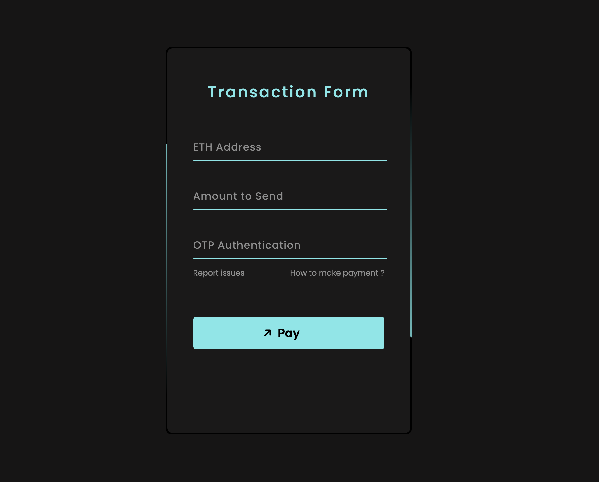
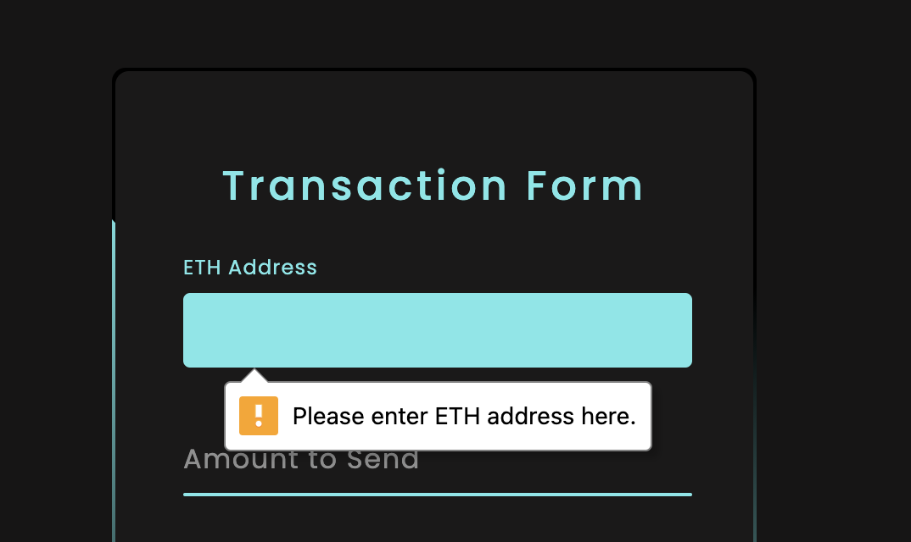
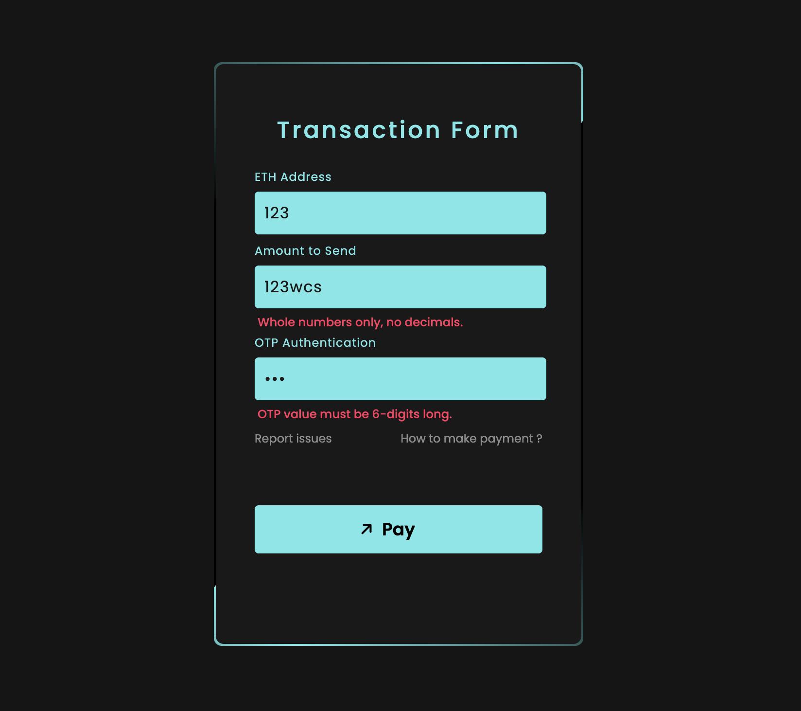
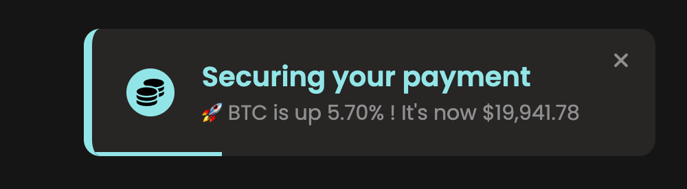
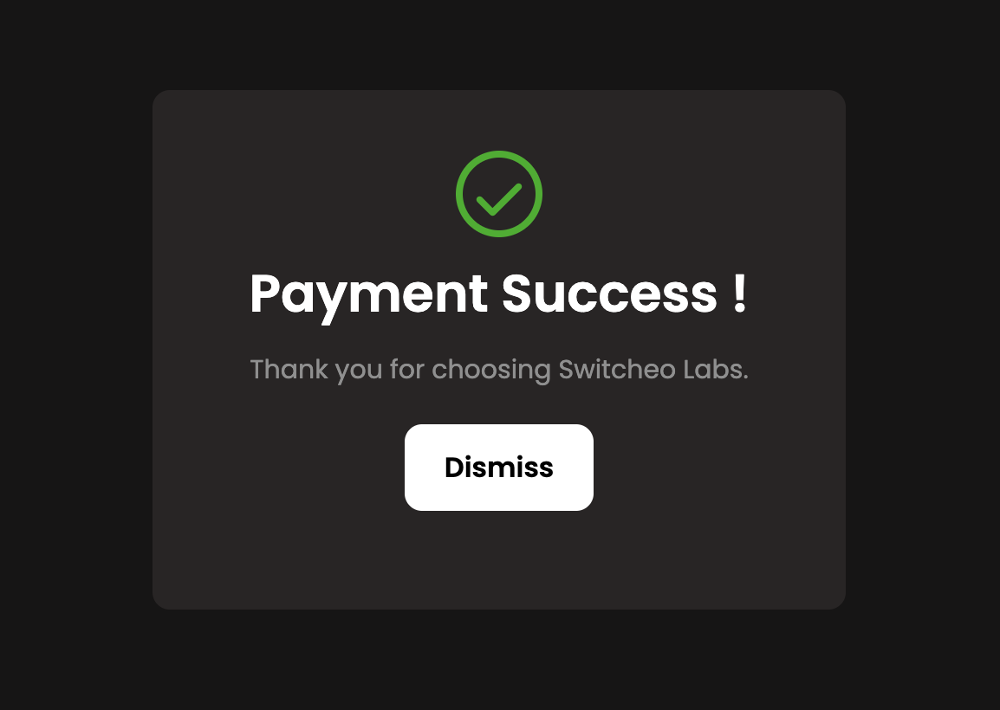
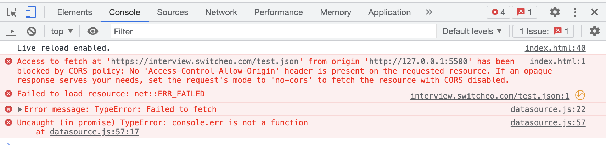
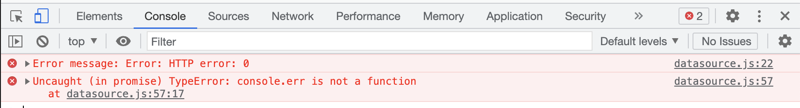

# switcheo-code-challenge-2023

## Cham Li Hui
### Frontend Software Engineer Intern 

[Switcheo Labs Code Challenge Problems](https://switcheo.notion.site/Switcheo-Code-Challenge-51dcf95e383e42c992a7fb302f9a4396?p=29747b8915524aba8d639c1170fee8ed&pm=s)
<br>
<br>

## Problem 1 : Three ways to sum to n 
Implemented using iteration (for loop and while loop), summation formula and recursion.  

Inspect page to test out code in console. 

## Problem 2 : Fancy Form 
Click [here](https://lihuicham.github.io/fancy-payment-form) to try out my fancy form !  
For best viewing experience, open it using Chrome browser on desktop.
<br>

### Design & Implementation (UI/UX & Frontend)
### (A) Dark theme design and animation for transition 
<br>


### (B) Form validation and error messages included
<br>





### (C) Mock interaction with backend service for loading using toast notification
<br>



### (D) Payment success modal
<br>



## Problem 3 : Datasource Connector Tool 

Implemented a `Datasource` utility class, along with a `Price` class. 

1. `getPrices()` method in `Datasource` class returns an array of prices. 
2. `mid()` method in `Price` class returns the mid-point value between `price.buy` and `price.sell`
3. `quote()` method in `Price` class returns the quote currency of trade pair.  

Inspect page to test out code in console. 

**Issues faced for this problem :**  
Data endpoint provided ([here](https://interview.switcheo.com/test.json)) is not working.

Issue 1 : Fetch request is blocked by CORS policy: No 'Acccess-Control-Allow-Origin' header is present on the requested source. 



Issue 2 : After changing `mode: no-cors`, HTTP status code 0 is shown (no response)



**Solution to the problem :**  
Created a mock endpoint by myself : [price-api](https://github.com/lihuicham/price-api)  
JSON for price-api : [link](https://my-json-server.typicode.com/lihuicham/price-api/data)

**Completed problem 3 with the mock data endpoint I created.**

## Problem 4 : Interacting with Chain 

Use NPM module [ether.js](https://docs.ethers.org/v5/) for this problem. 

**Issues faced for this problem :**  
Unsure about how to create the provider for Binance Smart Chain. 

**Solution to the problem :**  

```typescript
const API_KEY: string = 'ZYSINASEZYV8YSR4HVEWYU288XDS8VZK5V';  // my binance app API KEY
const provider = new ethers.providers.JsonRpcProvider(`https://api.bscscan.com/&apikey=${API_KEY}`);  
```

## Problem 5 : Utility Contract
Initiated truffle project and attempted with Solidity

## Connect with Li Hui
[Personal Website](https://www.lihuicham.com/) | [LinkedIn](https://www.linkedin.com/in/lihuicham/) | [GitHub](https://github.com/lihuicham) | [Medium](https://medium.com/@lihuicham)
